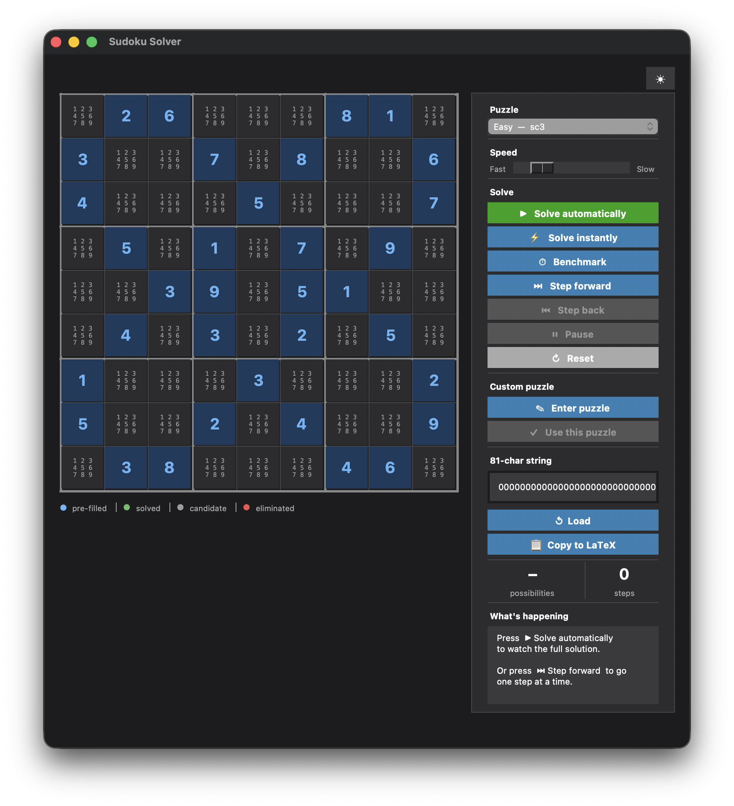

# Sudoku Solver

A Python Sudoku solver with an interactive GUI. Solves puzzles step-by-step with visual feedback.

## Features

- **4 preset puzzles** — Easy, Medium, Hard, Medium-hard
- **Custom input** — type digits directly into a grid or paste an 81-character string
- **Step-by-step solving** — watch constraint propagation and backtracking unfold, with explanations for each step
- **Instant solve** — solves the puzzle in one shot using MRV heuristic (minimum remaining values)
- **Benchmark** — solves using the pure backtracking solver and reports wall-clock time
- **Dark & light theme** — toggle with one click

## Project Structure

```
Sudoku.py      — Core solver: parsing, constraint propagation, backtracking
SudokuGUI.py   — Tkinter GUI
```



## Solving Algorithm

The solver uses two strategies:

1. **Constraint propagation** (`limitations`) — repeatedly removes impossible candidates per row, column, and box until no further eliminations are possible
2. **Backtracking search** — when propagation stalls, picks an unsolved cell and tries each candidate until the puzzle is solved

The GUI's step-by-step solver additionally finds **hidden singles** during propagation and uses the **MRV heuristic** during backtracking for maximum speed.

## Usage

```bash
python3 SudokuGUI.py
```

Or run the solver directly from the command line:

```python
from Sudoku import solve, sudoku

puzzle = "000500300201000000600000000050000190000460000000020000000000726000801000000000004"
solution = solve(sudoku(puzzle))
```


